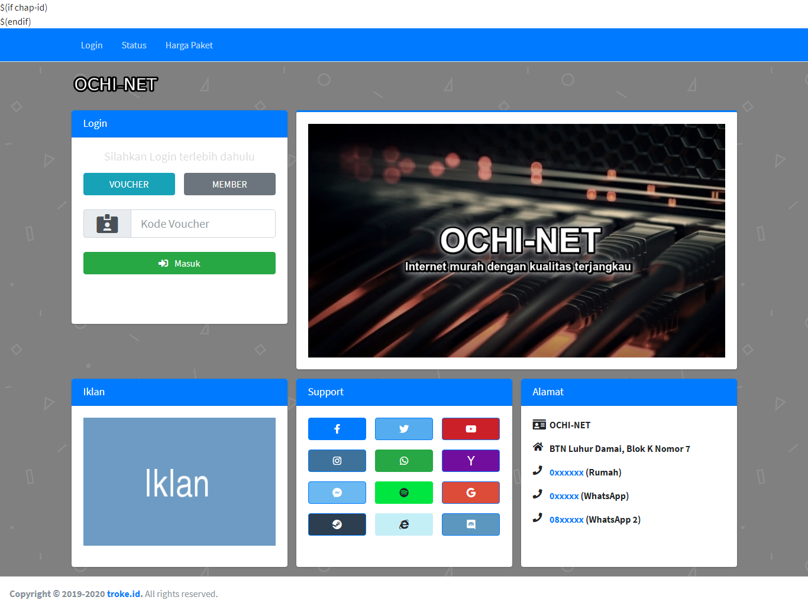
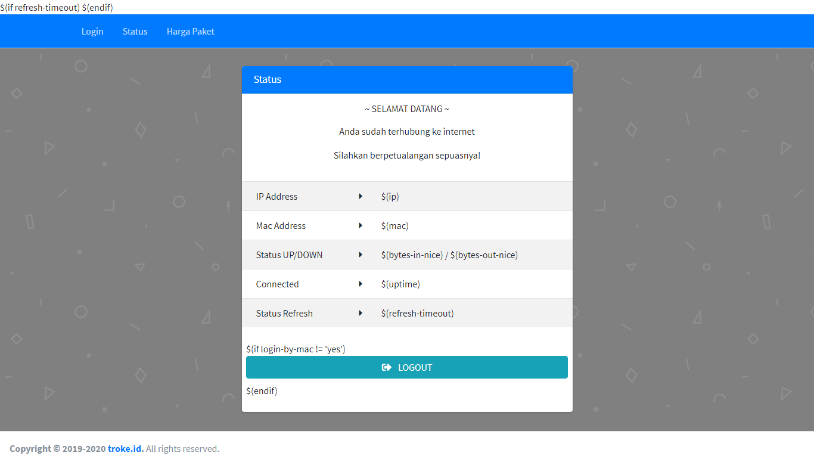
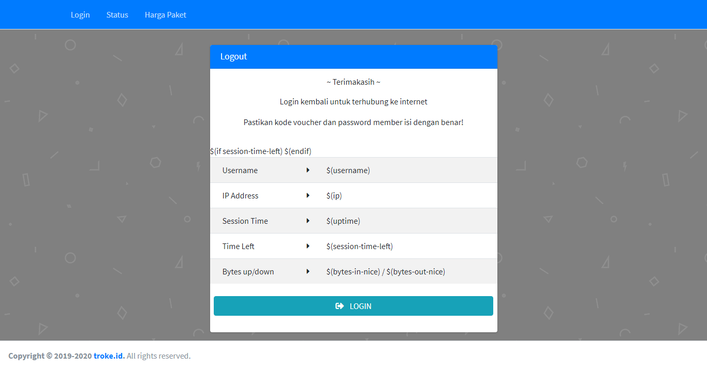

# BlueMi
Template login hotspot mikrotik simple made by Bootstrap and AdminLTE

Tolong, bila menemukan bug silahkan laporkan dengan cara open [issue!](https://github.com/troke12/BlueMi/issues)

Theme ini support dengan mikhmon

# To-do-list
* [x] Status page
* [x] Logout page
* [x] Redesign front page

# Cara pakai
* download dulu file paling terbaru [disini!](https://github.com/troke12/BlueMi/releases/latest)
* extract folder zip
* sebelum itu pastikan Hotspot Mikrotik sudah hidup
* pindahkan file *BlueMi* ke dalam mikrotik 
* lalu set server profile hotspot ke BlueMi 
* Selamat theme sudah ready

# Screenshot
## Login

## Paket

## Status

## Logout
